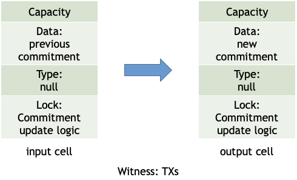
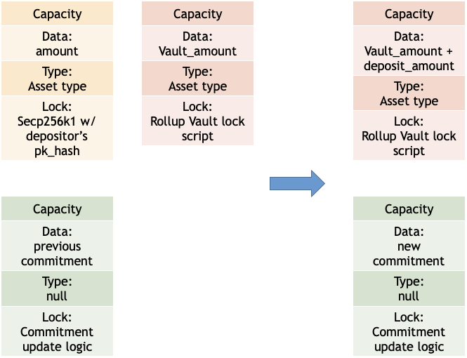
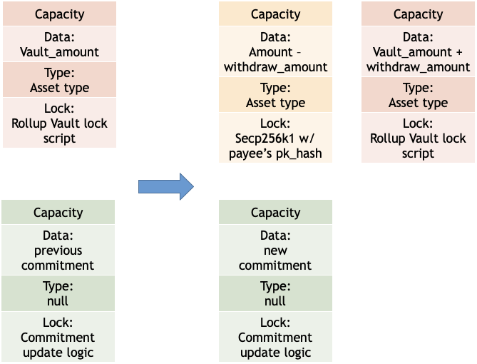

# Clover Protocol, a lightweight zkRollup approach for Nervos/CKB

*SECBIT Labs*

## What is zkRollup?

Proposed by Barry Whitehat in 2018,  zkRollup is a novel Layer-2 protocol that enables performance scaling of blockchains without compromising security. 

In zk-Rollup, users send transactions on a separate P2P network(usually called L2), a relayer (also called aggregator, operator) collects these transactions, verifies the validity of each transaction, and generates the new state of L2. Meanwhile, it generates a (succinct) SNARK proof, proving that the new state can be transitioned by the transition function formed by these transactions. After that, it sends a transaction to a L1 smart contract, i.e., it posts: (1)the new state of L2; (2) minimum bits (13 bytes for each transaction) of transition data; and (3) the SNARK proof that the transition function is valid. The transition data is put in the calldata region, which has a lower gas fee then directly put them on the state. Compared to other scaling solutions, zk-Rollup has several advantages: it solves the data availability problem; meanwhile, users almost have full control of their funds stored in L2. There's no need to be always online to submit a fraud-proof or participate in a game, which is vulnerable to DoS attacks. The safety level of users' funds is almost the same as L1. The throughput for the live zk-Rollup system on Ethereum is 300 TPS. So there's considerable potential to increase this number to 2000 TPS further. 

zkRollup needs to construct a new set of accounts on top of the Layer-1 protocol, as the state of the Layer-2. We can set up an off-chain node (called Operator) to process transactions for the Layer-2 protocol and to maintain and update the Layer 2 protocol's world state. To prevent the operator from doing anything bad, we require the operator to commit all transaction data onto the chain and then the Layer-1 protocol verify the reliability of the transaction data via a smart contract. If the operator simply puts all transactions up the chain naively, the efficiency of the Layer-2 protocol will be limited by the performance of the Layer-1 protocol, and performance scaling will not be possible. Then cryptography comes in. zkRollup employs cryptography in two places, allowing Layer-1 smart contracts to verify Layer-2 transaction data at a fraction of the cost of Layer-1 smart contracts. 

The first place is the maintanence of the world state. Layer-1 protocol needs to maintain a large world state for verifying transactions, and the cumulative cost of reading and writing world state is extremely high. zkRollup uses a cryptographic commitment to compress a large world state into one (taking a few hundred of bytes). The cryptographic commitment guarantees both "binding" and "hiding" properties. The binding property means that the Layer-2 Operator has no ability to tamper with the world state. A Layer-2 operator is required to submit transaction data along with some cryptographic 'proofs' showing that certain state data belongs to the current world state, and a Layer-1 smart contract can be informed of the validity of the state data by simply verifying the 'proofs'.

The other place is the verification of the validity of transactions. Whether a transaction is valid includes three parts: the validity of the transaction amount, the validity of the transaction signature, and the validity of the transaction data. In the absence of complete world state, these verifications cannot be performed by a Layer-1 smart contract either, and the Layer-2 operator needs to submit a Zero-knowledge Proof to prove that she has completed the transaction validation computation off-chain, and that the world state on which this computation is based corresponds to the commitment of world state stored on the Layer-1.

In the past, zkRollup frameworks were proposed, such as Loopring, zksync, etc., use zkSNARKs (esp., Groth16) to compress the computation over the world states. However, the frameworks are heavyweight, needing huge computing resources. Due to the bottleneck of SNARKs, zk-Rollup is not easy to implement complex logics other than payments and order book based DEXs so far. Another type of Rollup is optimistic Rollup introduced by John Adler in 2019. In short, it also put the data on-chain, but not using zk-SNARK for verification to achieve general-purpose applications. The amount of data becomes larger because users' signatures are put on-chain. Therefore the transaction speed will be less than ZK Rollup. The other part is that users need to participate in a validation game to ensure data validation because it does not use validity proof for verification.

## Our approach: Clover Protocol

In this whitepaper, we introduce a lightweight zkRollup framework, Clover Protocol, designed for CKB blockchain, which combines Aggregatable Sub-Vector Commitment and Zero-knowledge Proofs such that the computation burden off-chain is reduced to an affordable level. At the same time, the cost of storing on-chain data is considerably low on CKB, thanking to the briliant CKB economic model. The main highlight of Clover protocol are summarized below:

1. Lightweight off-chain computation
2. Economical cost of on-chain storage
3. Compressed off-chain transactions

## Why Rollup on Nervos?

Nervo's design philosophy is that the computation is done off-chain(L2, L3...), while the L1 blockchain, the Common Knowledge Base, is responsible for verification for the validity of the computation. This design paradigm makes Rollup(especially zk-Rollup) a natural and perfect L2 solution fit for CKB L1. Indeed, recently Nervos Foundation proposed Godwoken -- a framework to build Rollup solutions upon Nervos CKB, which offer optimistic rollup and zk rollup templates, and a bunch of customizable components. Therefore developers and service providers can composite their rollup solutions to fit different scenarios. 

The Clover protocol takes full advantage of the Cell model in the CKB architecture. The *type* field in the Cell enables secure updating of Commitment, and the updating process does not increase the amount of data in the Cell, thus reducing the Operator's cost. Similarly, transaction blocks committed to the Cell also consume no additional CKB and are only subject to the VM cycles consumed by the proof. Type-specified smart contracts relax the restriction on operator roles, so multiple operators can be introduced, preventing a single point of failure in Layer 2.

Clover uses one Cell as a Pool to hold all assets (one UDT) deposited by the user, and since there are only Transfer transactions in the Operator's submitted block, this Cell is consumed, creating a new Cell of the same size. For deposit, an additional UDT Cell needs to be merged with the asset pool as an input. For a withdraw operation, the user can withdraw his balance to a new Cell.

## What is aSVC and why it's important?

Aggregable Sub-Vector Commitment (aSVC) is based on [KZG10] and requires a *Trusted-Setup*, which can be performed by multiple parties together in a Setup ceremony that generates a Common Reference String (CRS), where the parties involved in the ceremony need to generate a random number and forget about it after the setup. There are often questions about the security of the Trusted-setup, but the CRS of [KZG10] supports updates that greatly reduce the security risks associated with the complicity of all participants in the Trusted-Setup process. That is, after the CRS is generated, if any party or new participant questions the security of the CRS, she can generate a random number again, update the CRS, and then forget about the random number. The updated CRS does not affect aSVC's algorithm.

The scheme of aSVC does have the following advantages:

1. aSVC supports aggregation of multiple proofs to prove membership of a subvector when a block is packed with multiple transactions and each transaction needs to carry a proof.
2. aSVC's vector commitment is a point on an elliptic curve, and a commitment is only 64 bytes long if the elliptic curve group is of order 256bit or so. 
3. A vector commitment can represent a larger set in which each element is limited to 256 bits (BN254). Multiple vector commitments can be aggregated together directly when the elements to be aggregated need to hold more information. Thus more complex Layer-2 applications other than transfers can be supported.
4. aSVC maintains and updates all user account information Proof's parallel acceleration is relatively high.

The algorithmic complexity of aSVC (n is the length of the whole vector):

1. Prove that the complexity of the update is O(1) 
2. Update a commitment is O(1)
3. Proof generation for an element is O(1)
4. Verification algorithm is O(1)
5. Prove all elements is O(n*log(n))
6. Proof length is O(1)

At a high level, a VC(Vector Commitment) scheme allows a prover to compute a (usually succinct) commitment $c$ to a vector $\vec{v} = [v_0, v_1, . . . , v_{n−1}]$ of $n$ elements where $v_i \in Z_p$. The Binding property ensures that there couldn't (or with neglibible probability in computational setting) exists two different vectors with same commitment. Therefore, commitment can be seen as a compressed digest of a vector. Vector commitment scheme differs from plain cryptographic commitment scheme that, the prover can generate a proof $\pi_i$ that $v_i$ is the element at position $i$ in $\vec{v}$, and any verifier can check it against the commitment $c$, making VC scheme more useful than plain Commitment. The prover needs a proving key $prk$ to commit to vectors and to compute proofs, while the verifier needs a verification key $vrk$ to verify proofs (usually $|vrk| <<|prk|$). 

An aSVC(aggregratable Subvector Vector Commitment scheme ) scheme has some additional features against plain vector commitments: 

1. It support **updates**: if one or more elements in the vector change, the commitment and position proofs can be updated efficiently, instead of recomputing the commitment and proof from the whole new vector. For this, a static update key $upk_j$ tied only to the updated position $j$ is necessary. The proving, verification and update keys comprise the VC’s public parameters. 
2. It is a **subvector** commitment (SVC) scheme that supports computing succinct proofs for $I$-subvectors ($(v_i)_{i∈I}$) where $I \subset [0,n)$. 
3. It is **aggregatable**: multiple proofs $\pi_i$ for $v_i$ , $\forall i\in I$ can be aggregated into a single, succinct $I$-subvector proof $\pi_I$.


In fact, Merkle Tree can be seen as a type of vector commitment. The Merkle root can be seen as the commitment of a vector formed by leaf values. The Merkle path of a leaf forms a position proof. Nonetheless, people hardly treat Merkle tree in a vector commitment perspective since the Merkle tree seems to be the de facto standard to do vector commitment for granted nowadays. However, aSVC scheme implements the proof update and verification in far faster than Merkle tree based solution. Recently, Tomescu et al. proposed an aSVC scheme [TAB+20], with scalable updates over pairing-friendly groups. Compared to other pairing-based VCs, it has constant-sized, aggregatable proofs updated with constant-sized update keys. Furthermore, it supports computing all proofs in quasilinear time. Meanwhile, Tomescu et al. proposed used this aSVC scheme to construct a stateless cryptocurrency, which has very low storage, communication, and computation overheads. Their protocol shows the huge potential of aSVC schemes in cryptocurrency space. Take payment use case as an example, to verify the validity of transaction data. Relayers need to verify the sender's balance on L2 is large than the amount sender proposed to send. This statement can be implemented by a position proof by vector commitment, proving the sender's precise balance at a low cost. More importantly, the proof of different sender's balance can be aggregated into one aggregated proof. Therefore the verification complexity is extremely low.

## Our goal for the hackthon

1. Tomescu et al. proposed the aSVC scheme in paper [TAB+20], but they do not implement the scheme. Meanwhile, to the best of our knowledge, there is no public implentation of [TAB+20] aSVC scheme yet. So the practical performance of the scheme remains unknown. We aim to implement the scheme in Rust and test the performance , in order to get a more direct intuition of the scheme. 
2. Design and Implement a stateless cryptocurrency as L2 Rollup on Nervos CKB L1. 
3. Evaluate the feasibility of aSVC based approach L2 for building Rollup on Nervos CKB. 

## aSVC Explained

### aSVC primer

#### aSVC API

$VC.KeyGen(1^\lambda, n)\rightarrow prk,vrk,\vec{upk}$ : Randomized algorithm that, given a security parameter $\lambda$ and an upperbound $n$ on vector size, returns a proving key $prk$, a verification key $vrk$ and updated keys $\vec{upk}$ , where the dimension of $\vec{upk}$ is $n$.

$ VC.Commit(prk,\vec{v}) \rightarrow c$ : Deterministic algorithm that returns a commitment $c$ to any vector $\vec{v}$ of size $\leq n$.

$VC.ProvePos(prk,I,\vec{v}*{I}) \rightarrow \pi_i $ : Determinisitic algorithm that returns a proof $\pi*{I}$ that $\vec{v}_{I}$ is the $I$-subvector of $\vec v$ , $I$ can be either an index set $I \subset [0,n)$ or an individual index $I=i \in [0,n)$.

$VC.VerifyPos(vrk,c,\vec{v}*{I},I,\pi*{I}) \rightarrow True/False$ : Deterministic algorithm that verifies the proof $\pi_{I}$ that $\vec{v}_{I}$ is the $I$-subvector of the vector commited in $c$. 

$VC.VerifyUPK(vrk,i,upk_i) \rightarrow True/False$ : Deterministic algorithm that verifies that $upk_i$ is indeed the $i$th update key. 

$ VC.UpdateComm(c,\delta,j,upk_j)\rightarrow c'$ : Deterministic algorighm that returns a new commitment $c'$ to $\vec{v}'$ obtained by updateing $v_j$ to $v_j + \delta$ in the vector $\vec{v}$ committed in $c$.

$VC.UpdatePosProof(\pi_{i}, \delta, i, j, upk_i,upk_j)\rightarrow \pi_{i}'$ : Deterministic algorithm that updates an old proof $\pi_{i}$ for the $i$the element $v_i$, given that the $j$th element was updated to $v_j + \delta $, note that $i$ can be equal to $j$.

$VC.AggregrateProofs(I,(\pi_i)*{i \in I}) \rightarrow \pi*{I}$ : Deterministic algorithm that, given proofs $\pi_i$ for $v_i$, aggregrates them into a succinct $i$-subvector proof $\pi_{I}$.

### aSVC Security

#### commitment binding

$ \forall \vec{v} \neq \vec{v}'$ , $ VC.Commit(prk,\vec{v}) \neq VC.Commit(prk,\vec{v}')$

#### Commitment Update correctnetss

let $\vec{v}'$ be the same vector as $\vec{v}$ except with $v_j + \delta$ rather than $v_j$ at position $j$,

$ VC.Commit(prk,\vec{v}') = VC.UpdateComm(VC.Commit(prk,\vec{v}),j,upk_j)$

#### PosProof Update correctness

let $\vec{v}'$ be the same vector as $\vec{v}$ except with $v_j + \delta$ rather than $v_j$ at position $j$, 

$c \leftarrow VC.Commit(prk,\vec{v})$

$c' \leftarrow VC.Commit(prk,\vec{v}')$

$c \leftarrow VC.Commit(prk,\vec{v})$

$\pi_{i} \leftarrow UpdatePosProof(\pi_{i}, \delta, i, j, upk_i,upk_j)\rightarrow \pi_{i}'$

$VC.VerifyPos(vrk,c',v_{i},i,\pi_{i}') = True$

#### Proof aggregation correctness

$ \forall$ vectors $\vec{v}=(v_j)_{j\in[0,n)}$, $\forall$ index sets $I \subset[0,n)$, 

$c \leftarrow VC.Commit(prk,\vec{v})$

$\pi_{i} \leftarrow VC.ProvePos(prk,I,\vec{v}*{I})*{i \in I}$

$\pi_{I} \leftarrow VC.AggregrateProofs(I,(\pi_i)_{i \in I})$

$VC.VerifyPos(vrk,c,\vec{v}*{I},I,\pi*{I}) = True$

#### Update Key Uniqueness

$\forall$ non deterministic Probalisitc Polynomial Time adversaries $A$， 

$(i,upk,upk') \leftarrow A(1^{\lambda},prk,vrk,\vec{upk})$

$Pr[VC.VerifyUPK(vrk,i,upk)=True \wedge Pr[VC.VerifyUPK(vrk,i,upk')=True \wedge upk\neq upk'] \leq negl(\lambda)$ 

#### PosProof binding

$\forall$ non deterministic Probalisitc Polynomial Time adversaries $A$, if $\vec{v}*I=(v_i)*{i \in I}$ and $\vec{v}*J'=(v_j)*{j \in J}$: 

$(c,I,J,\vec{v}_I,\vec{v}_J',\pi_I,\pi_J) \leftarrow A(1^{\lambda},prk,vrk,\vec{upk})$

$Pr[VC.VerifyPos(vrk,c,\vec{v}*{I},I,\pi*{I}) = True \wedge VC.VerifyPos(vrk,c,\vec{v}*{J},J,\pi*{J}) = True \wedge \exists k \in I \cap J, s.t. v_k \neq v_k'] \leq negl(\lambda)$

## aSVC based L2 Rollup on Nervos CKB

### post_block



Suppose we create a data cell on CKB, storing the latest commitment of the aSVC based stateless cryptocurrency blockchain described above. The commitment cell can be updated (create a L1 transaction to destroy the old cell and create a new cell to store the variable) if and only if commitment update logic = True. Therefore, the lock script of commitment data cell is the logic described above in "validating blocks" paragraph. Transactions of the block (i.e., L2 rollup here) is used to verify the validity of state transistion, and will not be used later. Therefore, $a$ $INIT$ transactions and $b$ $SPEND$ transactions can be put in the witness field in the L1 transaction that update the commitment. We add a $tx_type$ field in the witness in order to let lock script distinguish different kinds of action, i.e., the lock script first checks the $tx_type$ and then do the verification against the corresponding $tx_type$. In addition, the lock script of commitment data cell shall also verify that there should be only one input cell contains old commitment and one output cell contains new commitment, in order to ensure that there is only one commitment data cell at each L1 block height. For simplicity, we omit input cell which is used for paying transaction fees. Constant values like public parameters of VC is stored in a fixed cell. When a script needs to load a constant, the data cell that stores the constant will be put in the cell_dep field of the L1 transaction. 

The data in CKB Transaction witness field will not stored in a cell, so the Rollup system don't need to pay for the data of L2 transactions, witness data is charged by transaction fee, which is quite low at $10^{-8}$ CKByte per bit. Since the position balance proofs can be aggregrated into one group element, the additional L2 transaction payload post to L1 can be ignored, compared to SNARK based zk-Rollup. (We remark here, this also signifcantly shows the advantage of aSVC over Merkle Tree).

So far, since L2 Rollup has its own state, in order to transform the aSVC based stateless cryptocurrency the remaining part is, how can a user "deposit" L1 asset to L2, and "withdraw" L2 asset to L1?

### deposit



The solution is, we create a vault cell. Like commitment cell, at each block height, there should be only one live vault cell. The Type field of vault cell is Asset Type, which is usally a UDT token script, to ensure the sum of UDT amount in the input cell is larger than that of output cell. 

If a depositor wants to deposit $deposit\_ammount$ UDT tokens to a receiver whose index in L2 is $row\_receiver$. The depositor creates a transaction which contains three type of input cell:

1. one or more UDT cell which Lock field is secp256k1 with depositor's pk_hash, the summation of data field of these cells is $deposit\_amount$
2. the vault cell, data is $vault\_amount$
3. the commitment cell, data is $c_0$

two types of output cell:

1. the vault cell, data is $vault\_amount+deposit\_amount$
2. the commitment cell, data is $c_1$

Other output cell with UDT type field can surely be added here, we just omit for simplicity.

the witness of this transaction is 

1. depositor's signature 
2. some update_commitment_witness，which consists of(but may not limited to):

- $c_1 = VC.UpdateComm(c_0, deposit\_ammount, row\_user, upk_{row\_user})$ 
- $i = row\_user$ 
- $\delta=deposit\_amout$ 
- $tx\_type=deposit$ 

The lock script of vault cell and commitment cell is exactly same (with same code_hash and args field), which first checks the $tx_type$ and then do the verificaiton against $tx\_type == deposit$:

1. There is one and only one commitment cell in input cell
2. There is one and only one commitment cell in output cell
3. There is one and only one vault cell in input cell
4. There is one and only one vault cell in output cell
5. $c_1=VC.UpdateComm(c_0, \delta, i, upk_i)$ 

A depositor can deposit at any time permissionlessly, as long as depositor sychronize the latest valid block. After this transaction is settled on CKB, miners and users can update balance position proof for $\pi_{j}'$ by $\pi_{j}'=VC.UpdatePosProof(\pi_{j}, \delta, j, i, upk_j,upk_i)$

We remark that, a depositor can deposit fund from his or her own L1 "account" to any user "account" on L2. Therefore, if $pk_{row\_user}$ does not equal depositor's $pk$, the actual action is a transfer action, i.e, depositor transfer $deposit\_amount$ tokens from his or her L1 account to someone else's L2 account.

### withdraw



Withdraw is very similar to deposit, with minor difference. 

If a payee with L2 account index $row\_payee$ wants to withdraw $withdraw\_ammount$ UDT tokens to a receiver whose pk_hash in L1 is $pk\_hash_{receiver}$. The payee creates a transaction which contains two type of input cell:

1. the vault cell, data is $vault\_amount$
2. the commitment cell, data is $c_0$

two types of output cell:

1. the vault cell, data is $vault\_amount-withdraw\_amount$
2. the commitment cell, data is $c_1$
3. one or more UDT cell which Lock field is secp256k1 with receiver's $pk\_hash_{receiver}$, the summation of data field of these cells is $withdraw\_amount$

the witness of this transaction is:

1. payee's signature for this tx
2. some update_commitment_witness，which consists of (but may not limited to):

- $c_1 = VC.UpdateComm(c_0, -withdraw\_ammount, row\_payee, upk_{row\_payee})$ 
- $i = row\_payee$ 
- $addr||nonce||v$ 
- $pk\_payee$
- $\pi_i$
- $\delta=-deposit\_amout$ 
- $tx_type=withdraw$ 

The lock script of vault cell and commitment cell is exactly same (with same code_hash and args field), which first checks the $tx_type$ and then do the verificaiton against $tx\_type == withdraw$:

1. There is one and only one commitment cell in input cell of tx
2. There is one and only one commitment cell in output cell of tx
3. There is one and only one vault cell in input cell of tx
4. There is one and only one vault cell in output cell of tx
5. $c_1=VC.UpdateComm(c_0, \delta, i, upk_i)$ 
6. $VC.VerifyPos(vrk,c_0,addr||nonce||v,i,\pi_{i}) = True$
7. $v>withdraw\_amount$
8. $ addr = H(row\_payee||upk_{row\_payee}||pk_{payee})$
9. payee's signature plus $pk\_payee$ can pass signature verification 

As same as deposit action, a payee can withdraw at any time permissionlessly, as long as payee sychronize the latest valid block.After this transaction is settled on CKB, miners and users can update balance position proof for $\pi_{j}'$ by $\pi_{j}'=VC.UpdatePosProof(\pi_{j}, \delta, j, i, upk_j,upk_i)$

As same as deposit action, we remark that, a payee can withdraw fund from his or her own L2 "account" to any user "account" on L1. Therefore, if $pk_{row\_receiver}$ does not equal payee's $pk$, the actual action is a transfer action, i.e, payee transfer $withdraw\_amount$ tokens from his or her L2 account to someone else's L1 account.

### Recap

To recap, in our system,there are 3 kinds of roles:

- user：An end user may own some UDT token and wants to send token to, or receive token from others. A user can deposit UDT tokens from L1 to L2, or withdraw tokens from L2 to L1 at anytime by constructing and sending transactions on L1.
- L2 relayer(also called operator/miner)：An operator collects a batch of L2 transactions, verify the validity of these transactions, computate and post the new state, together with validity proof and transaction information to SUV, in order to update L1 state.
- L1 State Update Validator (SUV): An SUV verify the validity of state update, based on the validity proof on chain. An SUV can be implemented as a program consisting of a script and corresponding state parameters, all stored on L1 cell. the script field in commitment cell and vault are both SUV script.

There are 3 types of actions:

- Deposit: a depositor deposit his or her L1 funds to an L2 "account"
- Withdraw: a payee withdraw his or her L2 funds to an L1 "account"
- Post_block: a L2 relayer post new commitment and corresponding batch transactions to L1, the transactions include a $INIT$ transactions and b$SPEND$ transactions.

### Security analysis

- Users can deposit funds from L1 to L2 or withdraw funds from L2 to L1 at any time, without permission by others. 
- Anyone can be L2 miner(relayer), so if a user suspects that his or her L2 tx is censored, he or she can act as a relayer to make a post_block action on L1 him or herself.
- Relayers cannot steal funds when posting L2 tx on L1 by implementing post_block action, because, in the corresponding L1 tx of post_block action, the only input/output cell involved is the commitment cell, vault cell cannot be involved.
- no one can generate invalid VC commitment and VC position proof due to the security property of aSVC scheme.

zkRollup relies on zero-knowledge proof to ensure the integrity of off-chain computations. Compared to Optimistic Rollup, it no longer relies on Fraud Proofs and requires an additional validator to monitor all on-chain transactions. However, zkRollup is not completely free of security issues, one of which is that the operator can deny service and refuse to submit a user's transactions to the chain. In this case, Clover will support two new strategies in the future: either the User can choose another Operator to submit transactions to, or the User can operate directly from Layer1.

The Clover protocol relies on aSVC, whose security assumptions rely on a relatively new Algebaric Group Model. The AGM assumes no unknown operations on the internal structure of the elliptic curve group, a security assumption that has not been widely accepted. The current implementation of Clover uses the BLS12-381 curve from the ZCash project, which achieves 128 bit security.

The Clover protocol relies on the CKB-ZKP library of zero-knowledge proof algorithms, which is currently under development and has not yet met the security requirements of a production environment. It hasn't been audited by any  third-party security teams.

### instantiation

The system has some setup parameters and we instantiate with these parameters: 

1. account_num: max amounts L2 Rollup supports, default is 1024
2. token_num: max UDT tokens L2 Rollup supports, default is 1
3. (code_hash, OutPoint, args): list of UDT token L2 supports
4. ellipitic_curve: the elliptic curve used when instantiating groups in vc scheme, default is BN256, BLS12-381 is also implemented and can be used
5. hash_algorithm: hash algorithm, default is MIMC

## Implementation 

We implement Clover Protocol as a runnable demo. The code can be found on github:

> https://github.com/sec-bit/clover-protocol

### Experimental Results 

The following tables show the performance of aSVC library.

| Vector Length (n) | Generate Commitment | Proving | Verify | Aggregation (m=100) | Update All | Update Commitment |  Verify UPK  |
| :---------------: | :-----------------: | ------- | ------ | :-----------------: | ------------ | ----------------- | ---- |
|        128        |        1 ms         | < 1 ms  | 3 ms   |        21 ms        | 113 ms     | < 1 ms            | 7ms |
|       1024        |        5 ms         | < 1 ms  | 3 ms   |        20 ms        | 951 ms | < 1 ms            | 7ms |
|       8192        |        31 ms        | 2 ms    | 3 ms   |        20 ms        | 7 s    | < 1 ms            | 7ms |
|      131072       |       360 ms        | 30 ms   | 132 ms |        21 ms        | 117 s  | < 1 ms            | 7ms |
|      1048576      |        2.2 s        | 330 ms  | 6 ms   |        27 ms        | 976 s      | < 1 ms            | 7ms |

The VM execution costs (mcycles = million cycles of CKB-VM):

|     Opt     | Contract Size | Register    | Deposit     |  Withdraw   | Transfer    |
| :---------: | :-----------: | ----------- | ----------- | :---------: | ----------- |
| opt-level=z |    103 KB     | 215 mcycles | 310 mcycles | 317 mcycles | 315 mcycles |
| opt-level=s |    221 KB     | 159 mcycles | 223 mcycles | 228 mcycles | 227 mcycles |

The size of cells:

| Capacity | Cell 1 | Commit Cell             |
| :------: | :----: | ----------------------- |
| n = 128  | 41 KB  | 12 KB (tx counts = 90)  |
| n = 1024 | 332 KB | 25 KB (tx counts = 175) |

The code of  can be divided into on-chain contract part, off-chain node part and ckb helper module.

```
├── Cargo.lock
├── Cargo.toml
├── README.md
├── asvc_rollup
├── capsule.toml
├── ckb_rpc
├── contracts
├── deployment.toml
├── migrations
├── mock
├── rollup
├── test.py
└── tests
```

1. Layer 1 script

   The On-chain contracts 

   * :: **contracts** on-chain unlocking script
     * :: Reading data for scripts (commit, initialize generation parameters (verifying key, update key, roots of unity))
     * :: Calling the block validation logic module (asvc_rollup) to perform block validation
     * :: Checking of UDT balances in the pool
   * **asvc_rollup** Block validator for data definition and unlocking scripts
     * :: Define the main data structures used within contract scripts
     * :: Block validator 
       * :: Validation of transaction blocks for deposit requests
       * :: Validation of trading blocks for withdraw requests
       * :: Validation of layer2 submitted blocks (including user registration and transfer transactions)

2. Layer 2 Operator

   * **rollup**: Off-chain operator
     * Operator
       * :: Complete user registration
       * :: Completion of transaction packaging for user transfers and registration operations
       * :: Updating of authentication information for all users
     * :: User client
       * :: Maintain user status (user FPK, nonce, balance information, etc.)
       * Send a registration request with operator
       * Send a transfer request to operator
       * :: Send of mortgage requests to Layer 1
       * :: Send of redemption requests to Layer 1

3. Helpers

   * **mock**: mock contract debugging tool
   * **ckb_rpc**: rpc interface to read data from the chain.
   * **test**: test scripts

## Next Step

### Solving the issue of creating invalid commitment cell
There remains a small issue in the design of current version: if an attacker creates a transaction, the transaction output cell contains a commitment cell, i.e., the `lock_script` field match the pre_defined commitment cell `lock_script`. According to the rule, if the commitment is updated, the attacker must put the commitment cell at latest height in the input cell. However, the transaction verification rule cannot prevent an attacker from not putting the latest commitment cell in this transaction. Therefore, the attacker can create commitment cell with arbitrary commitment data in the cell `data` filed, without destroying the latest valid commitment cell.

It is easy to solve this problem. We can add some verification rules in the commitment data cell's type script in order to ensure that only one commitment cell can be alive at each block height: The commitment cell can be initialized only once. After that, if the type script ensures that if a commitment cell is put in the output cell in a transaction, there must be one and only one commitment cell in the input of transaction. Therefore, if someone wants to update the commitment, he or she must destroy the old commitment cell, preventing the attacks described above.

We haven't implement this in the current version due to the time limit, we manage to implement this in the next version.

### Put constant parameter in a fixed cell and "invoke" them in `cell_deps` field

Constant parameters that SUV script uses during execution is designed to be stored in a fixed living data cell, i.e., every time SUV executes, the cells contain constant parameters shall put in the `cell_deps` field of the transaction. However, due to some technical reasons, at this moment, these cells are placed in `input_cell` and `output_cell` field.

### Add L2 tx fee

The transaction fee is ignored in this version. However, this is not reasonable to relayer. 

### Reduce L1 state

Public constant parameters are stored on Layer-1 cell, among them, the size of $\vec{upk}$ equals the predefined amount of accounts in the setup, so it cannot be too big. There's a VC API that can test the validity of a $upk$, with one elliptical curve pairing. We will do some tests and weighing the tradeoffs. 

### Reduce verification cycles

The Clover protocol has not yet been implemented to compress the transaction validity checking process, we will use the Marlin protocol[7] to compress the transaction validity checking calculation in the next update.

+ Signature Verification Process
+ Range proofs  of account balances

This compresses the validation overhead of the on-chain computation to O(1), plus the hash computation of the transaction data.

### Support more tokens in L2

We design the current system without considering more than one token. Thanks to the feasibility of CKB, it is easy to issue UDT tokens without redeploying contracts, make a new UDT instance make it very friendly to other apps. If our system wants to support more than 1 UDT tokens, we need to consider leveraging the advantage of this CKB feature. 

### Add signature verification to validity proof

In the current version, we focus on implementing the aSVC scheme and get some sense about the efficiency in verifying vector values and updating proofs at a low cost. However, the validity of transactions includes other factors, especially signature validity proof. We intend to use signature schemes with an aggregated feature. We also plan to use succinct ZKPs to generate signature validity proof. Both methods can solve the problem, but the performance trade-off differs a lot. So we will do further research and test to choose the proper solution.

### Expand scenarios from payment to more

In the current version, the Rollup only supports payment related action. We managed to explore more scenarios in the future, such as DEX.

### Multiple operators 

In order to improve the user experience, the proof of a user's account balance needs to be updated in real time, and this can be done by the Operator. Experimental data shows that updating the proof has a computational complexity of O(1), but maintaining the proof for millions of users is computationally intensive. By introducing multiple Operators, proof maintenance can be spread across multiple nodes. 

## References

- [1] Jan Xie.  Nervos CKB: A Common Knowledge Base for Crypto-Economy https://github.com/nervosnetwork/rfcs/blob/master/rfcs/0002-ckb/0002-ckb.md
- [2] Xuejie Xiao. CKB-VM. https://github.com/nervosnetwork/rfcs/blob/master/rfcs/0003-ckb-vm/0003-ckb-vm.md
- [3] Boneh, D., Drake, J., Fisch, B., Gabizon, A. and Protocol, A., 2020. Efficient polynomial commitment schemes for multiple points and polynomials. *IACR Cryptol. ePrint Arch.*, *2020*, p.81.
- [4] Kate, Aniket, Gregory M. Zaverucha, and Ian Goldberg. *Polynomial commitments*. Tech. Report CACR 2010-10, University of Waterloo, 2010.
- [5] Groth, Jens. "On the size of pairing-based non-interactive arguments." In *Annual international conference on the theory and applications of cryptographic techniques*, pp. 305-326. Springer, Berlin, Heidelberg, 2016.
- [6] Maller, Mary, Sean Bowe, Markulf Kohlweiss, and Sarah Meiklejohn. "Sonic: Zero-knowledge SNARKs from linear-size universal and updatable structured reference strings." In *Proceedings of the 2019 ACM SIGSAC Conference on Computer and Communications Security*, pp. 2111-2128. 2019.
- [7] Chiesa, Alessandro, Yuncong Hu, Mary Maller, Pratyush Mishra, Noah Vesely, and Nicholas Ward. "Marlin: Preprocessing zksnarks with universal and updatable srs." In *Annual International Conference on the Theory and Applications of Cryptographic Techniques*, pp. 738-768. Springer, Cham, 2020.
- [8] Tomescu, Alin, Ittai Abraham, Vitalik Buterin, Justin Drake, Dankrad Feist, and Dmitry Khovratovich. "Aggregatable Subvector Commitments for Stateless Cryptocurrencies." IACR Cryptol. ePrint Arch. 2020 (2020): 527.
